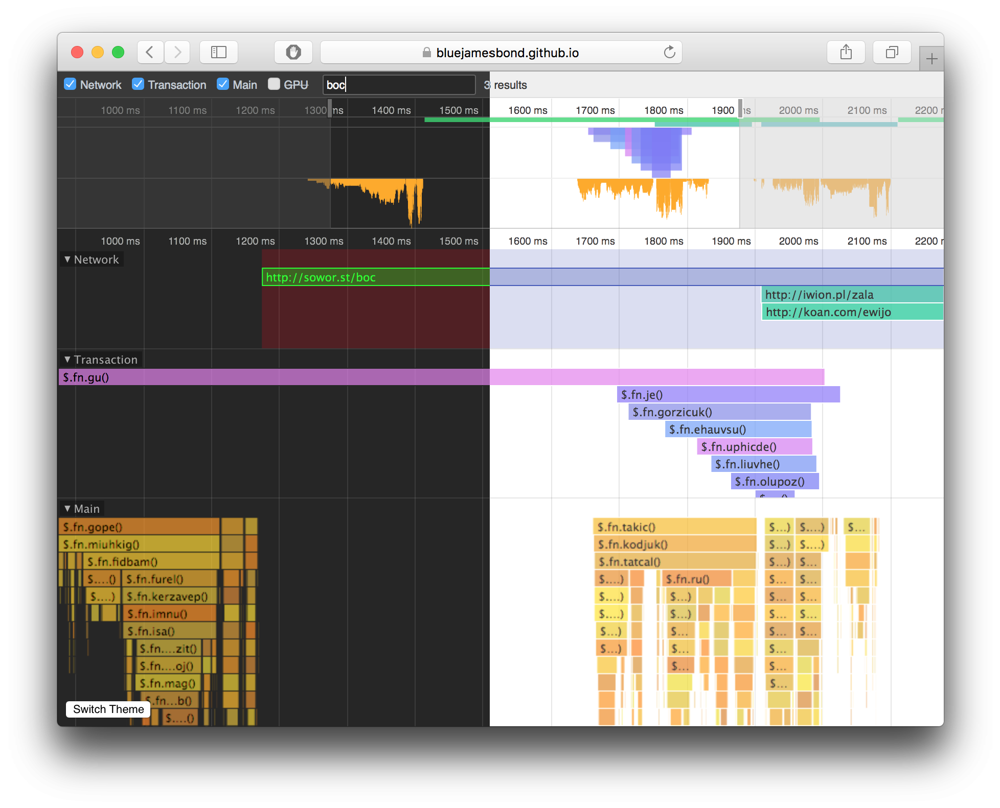

# FlameChart.js
A flamechart component (based on Chrome DevTools). Can be used as a React component or used as a standalone library.

## Credits
This library has code borrowed from Chrome DevTools as described in the LICENSE file and due credit goes to Chrome Team. Credit headers will be assigned to each file in the coming days.



## Features
- Built on React
- Scroll with mouse wheel
- Move with mouse drag
- Customize hover tooltips
- Controlled height + width
- Resizable panes (split panes)
- Listen to event/timing clicks
- Downgrades quality automatically to ensure performance
- Add themes easily with `styles` prop
    - Two built-in themes currently (`Light` and `Dark` like DevTools)
- Filter/search entries

## Demo
View the demo [here](https://bluejamesbond.github.io/FlameChart.js/)

## Example
Offers a standalone and React based mode (NOTE: Documentation is a WIP).

### Standalone

#### Import SimpleFlameChart.js script
Download and import [SimpleFlameChart.js](dist/SimpleFlameChart.js)
```html
<script type='text/javascript' src='SimpleFlameChart.js'></script>
```

#### Render
```js
window.injectSimpleFlameChartStyles();

let { Green } = window.HSLColorGenerator;

let timings = [
    { name: '//google.com', start: 0, end: 200, type: 'request' },
    { name: '//github.com', start: 10, end: 190, type: 'request' },
    { name: '//reddit.com', start: 20, end: 170, type: 'request' }
];

let element = document.getElementById('flamechart');

let simpleFlameChart = window.renderSimpleFlameChart({
  timings: timings,
  theme: 'light',
  start: 0,
  stacks: [
    {
      name: 'Network',
      types: ['request'],
      defaultHeight: 1, // 1 means "100%"
      getTimingColor(timing) {
        return Green.colorForID(timing.name)
      }
    }
  ]
}, element);

// SimpleFlameChart#setTimingSelected(timing, selected)
// SimpleFlameChart#isTimingSelected(timing)
// window#unrenderSimpleFlameChart(element)
 ```

### React Usage (Simple)
SimpleFlameChart enables searching and stack toggling

```jsx
import { SimpleStack, SimpleFlameChart, injectSimpleFlameChartStyles } from 'react-flamechart';
import { Green } rom 'react-flamechart/libs/helpers/HSLColorGenerator'

injectSimpleFlameChartStyles();

class Test {
    timings = [
        { name: '//google.com', start: 0, end: 200, type: 'request', highlighted: true },
        { name: '//github.com', start: 10, end: 190, type: 'request' },
        { name: '//reddit.com', start: 20, end: 170, type: 'request' },
        { name: 'Microprocessing', start: 20, end: 170, type: 'gpu' }
    ]

    _getTimingColor(timing) {
        return Green.colorForID(timing.name)
    }

    render() {
        const { timings, state } = this;

        return (
            <SimpleFlameChart start={0}
                              theme={'dark'}
                              timings={timings}>
              <SimpleStack name='Network'
                           types={['request']}
                           defaultHeight={0.8}
                           getTimingColor={::this._getTimingColor} />
              <SimpleStack name='GPU'
                           types={['gpu']}
                           defaultHeight={0.2}
                           getTimingColor={::this._getTimingColor} />
            </SimpleFlameChart>
        );
    }
}
```

### React Usage (Advanced)
Using the base FlameChart React components offers the most customization.

```jsx
import { Dark, FlameChart, Stack } from 'react-flamechart';

class Test {
    timings = [
        { name: '//google.com', start: 0, end: 200, type: 'request', highlighted: true },
        { name: '//github.com', start: 10, end: 190, type: 'request' },
        { name: '//reddit.com', start: 20, end: 170, type: 'request' }
    ]

    state = { width: 500, height: 500 };

    _entryStartGetter = ({end}) => end;
    _entryEndGetter = ({start}) => start;
    _entryNameGetter = ({name}) => name;
    _entryHighlightedGetter = ({highlighted}) => highlighted;
    _entryFillGetter = ({name}, type) => Warm.colorForID(name);

    render() {
        const { timings, state } = this;
        const { width, height } = state;

        return (
            <FlameChart min={0}
                        max={200}
                        start={0}
                        styles={Dark}
                        width={width}
                        height={height}>
              <Stack name='Network'
                     overviewHeight={40}
                     defaultHeight={1} // 1 = "100%"
                     timings={timings}
                     entryStartGetter={this._entryStartGetter}
                     entryEndGetter={this._entryEndGetter}
                     entryNameGetter={this._entryStartGetter}
                     entryHighlightedGetter={this._entryHighlightedGetter}
                     entryFillGetter={this._entryFillGetter} />
            </FlameChart>
        );
    }
}
```

## TODO
- Improve Calculator.js
    - Add props attribute to contain all properties
- Ensure heights <= 1
